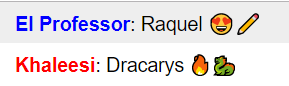

# nodejs-workshop-chat
## Description
Creating a chat room as part of our Node.js Workshop

<br/>

## About the Node modules:
**[Express](https://expressjs.com)** - Express is lightweight web application framework for Node.js. For this simple group chat, it is not necessary to use Express, but if you are planning to continue the development, this is nice to have.  

**[Socket.io](https://socket.io)** - Socket.io is the key module in this tutorial which enables the realtime communication between the clients and the server.  

<br/>

## Credits
**This exercise is based on the example supplied by socket.io:**  
 https://github.com/socketio/chat-example

<br/>

## The Exercises
#### Support User Names


1. Edit client.js:
   - Implement a way to get the user's name, by pop-up of any other method. You can use promt() function.
   - Make sure that the username variable has a default value (not empty).
   - Emit the username's value, through the socket, to the server:
      > ```javascript
      > socket.emit('username client -> server', username)
      > ```

2. Edit server.js:
   - handle the event of ```'username client -> server'``` and add to the socket a new property:
   > ```javascript
   > socket.on('username client -> server', function (username) {
   >  socket.username = username;
   > });
   > ```
   
   - Use this ```username``` property when sending the chat message back to the client.

3. **BONUS**: Implement a way so each user will have their own color (use random / array of colors).

<br/>

#### Present to the user their username
1. Edit index.html:
   - Add to the header at index.html a new div:
   > ```html
   > <div id=logged_as_info></div>
   > ``` 
   - This div will present to the user their username.
   - You can add css properties or inline style to this div.

2. Edit server.js: 
   - When recieving the ```'username client -> server'``` event in the server, emit an event to the client with the info we want to represent inside the newly created div.

3. Edit client.js:
   - Handle the event that was sent from server.
   - Using jQuery, edit the info inside the newly created div to contain the information we just sent from the server.
   - Use appending a message as an example.


<br/>

 ## Further Ideas
 - CSS: set a maximum width for each message.
 - Disable the option of sending an empty message.
 - Delete a message:
    - Add a button to each message in order to delete it.
 - Like a message:
    - Same as deletion.
    - Think of a way to filter the messages so only Liked messages will be seen.
    - Think of a way to mark the liked messages so only the relevant user will see their liked messages.
 - Add a profile picture:
    - Maybe you can use a Node.Js package called 'fs' to upload files from the file system. 
 - Support private chat:
    - Assume that each user has a unique user ID.
 - Use a DB:
    - So messages will be saved even when the server shuts down
    - Can use a Node.Js package called 'MongoDB'.
- Improve styling:
   - Each user will have their own color.
   - You can use functions of jQuery UI: Start with https://www.w3schools.com/jquery/jquery_slide.asp and continue from there.
- Verify that each user has a unique name.